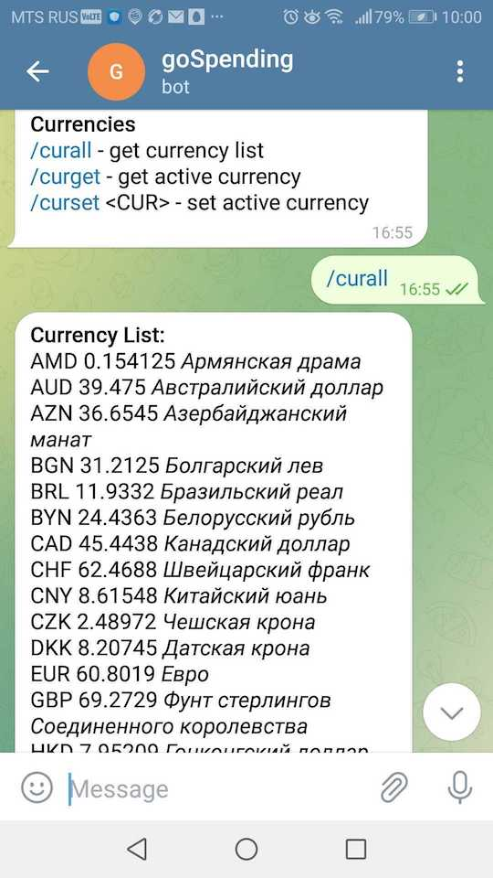
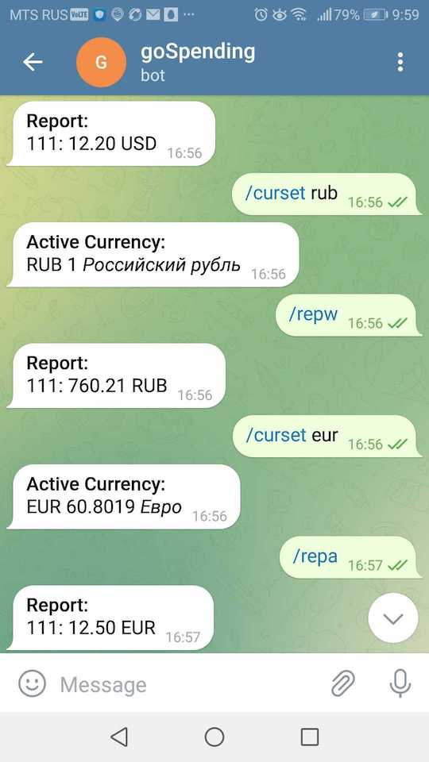

# goSpendingBot

> В процессе разработки

Телеграмм-бот для контроля расходов

<tr>
    <td>  </td>
    <td>  </td>
</tr>

## Основные команды

**Expenses**

- /addexp <category name> <amount> [dd/mm/yy]  - add new expense

**Edit Categories**

- /newcat <category name> - create a new expense category
- /listcat - get a list of your expense categories

**Reports**

- /repw - get a weekly report by category
- /repm - get a monthly report by category
- /repa - get the annual report by category

**Currencies**

- /curall - get currency list
- /curget - get active currency
- /curset <CUR> - set active currency
